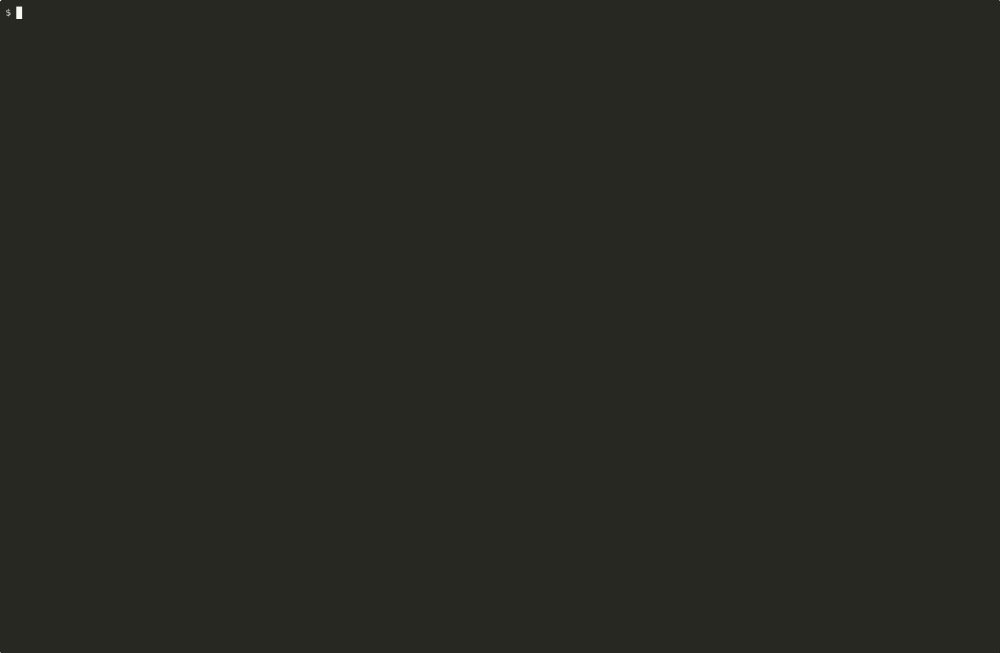

# tmux_explode

A tmux plugin that "explodes" every tmux window into a single tiled overview
window of split panes, then "unexplodes" them back to their original windows.
One keybinding to glance at every running terminal at once, then return to
focused work.



(Server-scope wall: five sibling sessions tiled into one overview, recorded
in a Linux container. Reproduce with `docker build -f tests/Dockerfile.record
-t tmux-explode-record . && docker run --rm -it tmux-explode-record`.)

## Install

### Via [TPM](https://github.com/tmux-plugins/tpm) (recommended)

Add to your `~/.tmux.conf`:

```tmux
set -g @plugin 'wbern/tmux-explode'
```

Then `prefix + I` to install.

### Manual

```sh
git clone https://github.com/wbern/tmux-explode ~/.tmux/plugins/tmux-explode
```

Add to `~/.tmux.conf`:

```tmux
run-shell ~/.tmux/plugins/tmux-explode/tmux_explode.tmux
```

Reload tmux: `tmux source-file ~/.tmux.conf`.

## Usage

`prefix + O` toggles between the two modes:

- **Explode** — gather panes from every window into a new `overview` window,
  laid out tiled.
- **Unexplode** — break each pane back out, restoring the original window name.
  Panes that originated from the same source window are grouped back together.

Set `@explode-scope 'server'` to gather every **other session** on the tmux
server instead — each session becomes a nested-attach pane added to the
**current window in place** (no new window is created), giving you a live
wall of every running tmux session alongside your original pane. Zoom into
one with `prefix + z`, and toggle off again to drop the added panes.

## Configuration

All options are read fresh on each toggle, so changes take effect without
re-sourcing `tmux.conf`.

| Option                  | Default     | Description                                                          |
| ----------------------- | ----------- | -------------------------------------------------------------------- |
| `@explode-key`          | `O`         | Key bound under `prefix` to trigger the toggle.                      |
| `@explode-scope`        | `session`   | `session` = gather panes from the current session's windows. `server` = gather every **other** session on the tmux server (one nested-attach pane per session). |
| `@explode-mode`         | `active`    | `active` = gather only the active pane of each window. `all` = sweep every pane. (Session scope only — ignored when `@explode-scope = server`.) |
| `@explode-window-name`  | `overview`  | Name used for the overview window in **session scope**. Server scope splits the current window in place and ignores this option. |

Example:

```tmux
set -g @plugin 'wbern/tmux-explode'
set -g @explode-key 'E'
set -g @explode-mode 'all'
set -g @explode-window-name 'glance'
```

## Behavior notes

- Above ~6 windows/sessions the tiled layout becomes cramped; `prefix + w`
  (`choose-tree -Zw`) is genuinely the better tool at that scale.
- Pane origin is tracked via the per-pane tmux user option `@orig_window`
  (session scope) or `@orig_session` (server scope), set when the pane is
  gathered.
- If a window with the configured overview name already exists, explode is a
  no-op and shows a status-line message — rename the existing window or pick a
  different `@explode-window-name`.
- Automated visual snapshot tests run in CI on `ubuntu-latest`; also tested
  manually on tmux 3.6a (the version that ships via Homebrew on recent
  macOS).

### Server-scope notes

- The wall is built **in place** by splitting the calling window. Your
  original pane stays put as one tile; sibling sessions are added as new
  panes alongside it. Toggling off kills the added panes and restores your
  original pane to the full window — no extra tab to navigate, and a
  single-window session can never be collapsed by the toggle.
- Added panes are tagged with the per-pane user option `@orig_session`,
  pointing at the session each one is attached to.
- Each spawned pane runs `tmux attach -t <session>` against the same socket.
  tmux's prefix collision is **not** worked around — to send `prefix` (default
  `C-b`) to a focused inner session, press it twice (`C-b C-b`).
- Inner sessions get their `status` option set to `off` while the wall is
  active so status bars don't stack inside each pane. The previous value is
  restored on unexplode.
- [tmux-resurrect](https://github.com/tmux-plugins/tmux-resurrect) and
  [tmux-continuum](https://github.com/tmux-plugins/tmux-continuum) are the
  only real footgun: an autosave that fires while a server-scope wall is
  exploded will capture the nested attaches and try to restore them on
  startup. Toggle the wall off before letting an autosave run, or pause
  continuum while you have one open.

## Development

The plugin is two files:

- `tmux_explode.tmux` — TPM entrypoint. Reads `@explode-key` and binds it.
- `scripts/overview_toggle.sh` — the toggle logic. Re-reads runtime options on
  every invocation.

Run `./tests/visual.sh` to exercise session scope (both `active` and `all`
modes), the session-scope round-trip, server scope across multiple sibling
sessions, and the server-scope round-trip — all on an isolated tmux socket.

For a live demo or to capture screenshots, use `./tests/demo.sh`:

```sh
./tests/demo.sh server attach                # build a wall and attach to it
./tests/demo.sh session capture /tmp/explode # headless: dump SVG + per-pane text
```

Capture mode also writes a colour-preserving HTML overview if
[`aha`](https://github.com/theZiz/aha) is installed (`brew install aha`).

Issues and PRs welcome.

## License

MIT — see [LICENSE](LICENSE).
