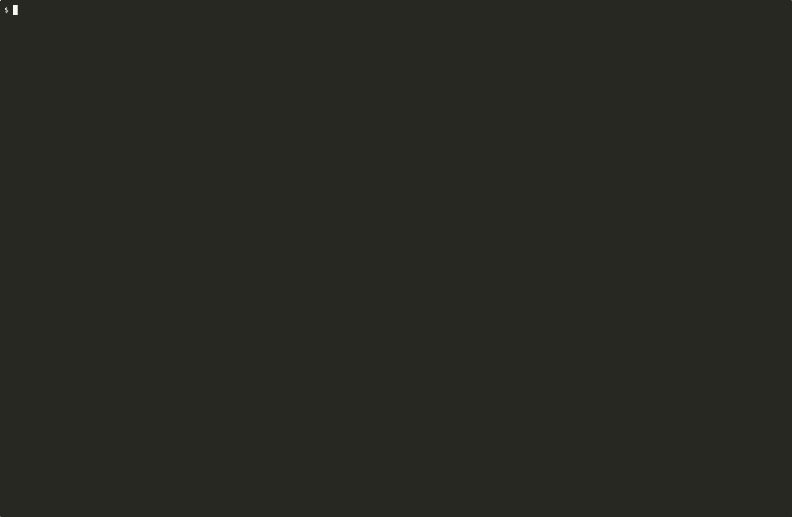

# tmux_explode

[](https://github.com/wbern/tmux-explode/actions/workflows/test.yml)
[](https://github.com/wbern/tmux-explode/actions/workflows/release.yml)
[](https://github.com/wbern/tmux-explode/releases)
[](LICENSE)

A tmux plugin that "explodes" every tmux window into a single tiled overview
window of split panes, then "unexplodes" them back to their original windows.
One keybinding to glance at every running terminal at once, then return to
focused work.



(Eight sibling sessions humming away, then `prefix + O` snaps them all into
one overview. Reproduce with `./tests/record_demo.sh --quick` (needs
`asciinema` and `agg` on PATH; `brew install asciinema agg`). A longer
walkthrough that visits each session before exploding lives in
[`docs/demo.gif`](docs/demo.gif).)

## Install

### Via [TPM](https://github.com/tmux-plugins/tpm) (recommended)

Add to your `~/.tmux.conf`:

```tmux
set -g @plugin 'wbern/tmux-explode'
```

Then `prefix + I` to install.

### Manual

```sh
git clone https://github.com/wbern/tmux-explode ~/.tmux/plugins/tmux-explode
```

Add to `~/.tmux.conf`:

```tmux
run-shell ~/.tmux/plugins/tmux-explode/tmux_explode.tmux
```

Reload tmux: `tmux source-file ~/.tmux.conf`.

## Usage

`prefix + O` toggles a tiled wall of every terminal on your tmux server and
back. By default the wall covers **everything**: panes from your current
session's other windows AND nested attaches to every other session, all
added alongside your original pane in the current window. Zoom into any
tile with `prefix + z`. Toggle off and the wall collapses — added panes are
killed, gathered panes return to their origin windows, and the session
you fired from is left exactly as it was.

Two narrower scopes are available for users who want a tighter view — set
`@explode-scope` to override the default:

- **`session`** — gather panes from the current session's windows into a
  new `overview` window. Other sessions are ignored.
- **`server`** — only nest-attach the *other* sessions, leaving your
  current session's other windows alone.

## Configuration

All options are read fresh on each toggle, so changes take effect without
re-sourcing `tmux.conf`.

| Option                  | Default     | Description                                                          |
| ----------------------- | ----------- | -------------------------------------------------------------------- |
| `@explode-key`          | `O`         | Key bound under `prefix` to trigger the toggle.                      |
| `@explode-scope`        | `all`       | `all` = current session's other windows AND nested attaches to every other session, in the current window. `session` = only the current session's windows (uses an `overview` tab). `server` = only nested attaches to other sessions, in the current window. |
| `@explode-mode`         | `active`    | `active` = gather only the active pane of each gathered window. `all` = sweep every pane. Applies to local-window gathering in `all` and `session` scopes; ignored when `@explode-scope = server`. |
| `@explode-window-name`  | `overview`  | Name used for the overview window in **session scope** only. `all` and `server` scopes split the current window in place and ignore this option. |
| `@explode-style-anchor` | `fg=yellow,bold` | Style applied to the anchor tile's border label (the pane the toggle fired from). Colors the label only — the border line itself is unchanged. In-place walls only. |
| `@explode-style-local`  | `fg=cyan`   | Style applied to the labels of tiles gathered from other windows of the current session. In-place walls only. |
| `@explode-style-remote` | `fg=magenta` | Style applied to the labels of nested-attach tiles pointing at sibling sessions. In-place walls only. |
| `@explode-layout`        | `columns`   | `columns` (default) = column-biased custom layout — taller tiles, better for reading streaming output. `tiled` = tmux's built-in tiled layout (the pre-1.x default). |
| `@explode-min-pane-width` | `40`        | Floor on per-column width (cells) when the layout builder picks a column count. Prevents tiles from getting too narrow to read on ultrawide screens with many panes. Ignored when `@explode-layout = tiled`. |
| `@explode-target-aspect` | `0.5`       | Target tile aspect ratio (width ÷ height). Default `0.5` = each tile ≈ 2× as tall as wide. Lower = even taller; `1.0` = square; `2.0` = landscape. Ignored when `@explode-layout = tiled`. |
| `@explode-heatmap`       | `on`        | When `on`, prepends a per-tile activity heatmap glyph (⚪ no observation yet, 🔥 hot, 🌶 warm, 💤 cool, ❄ cold) to each border label so you can glance at the wall and see which agents are producing output now vs. which have gone quiet. Set to `off` to skip the poller and keep borders unchanged. In-place walls only. |
| `@explode-dim-cold`      | `on`        | When `on`, the heatmap poller also dims the `pane-style` of cool (💤) and cold (❄) tiles so your eye skips quiet panes. Apps that emit explicit ANSI colors override the dim default — the effect is strongest on uncolored content. Set to `off` to keep the bucket glyph but leave tile colors untouched. Requires `@explode-heatmap` on. |
| `@explode-style-cool`    | `bg=#0a0a18` | Per-pane style applied to 💤 (cool) tiles via `select-pane -P`. Defaults to a faint navy bg — `fg=` overrides only show through on uncolored cells (rare on TUI walls), and on dark terminals you can't make a tile recede via contrast (no color is darker than #000). A faint blue *hue* reads semantically as "asleep" without screaming for attention. Hex values bypass terminal palette remapping. |
| `@explode-style-cold`    | `bg=#10102a` | Same idea as cool, slightly more saturated so cold tiles read as "more parked" than cool ones. |
| `@explode-close-key`     | `X`         | Key bound under `prefix` while a wall is up to kill the focused tile and re-tile. The binding is installed on explode and removed on toggle-off; any pre-existing binding for the same key is saved and restored, so your normal tmux setup is left untouched outside the wall. Refuses to close the anchor (kill anchor and the wall has no return point — use the toggle to unexplode instead). Default `X` is unbound in vanilla tmux. Set to `off` to opt out entirely. |

Example:

```tmux
set -g @plugin 'wbern/tmux-explode'
set -g @explode-key 'E'
set -g @explode-mode 'all'
set -g @explode-window-name 'glance'
```

## Behavior notes

- The wall is laid out with a column-biased custom layout (the new
  default — earlier versions used tmux's built-in `tiled`). Tiles are
  taller and narrower (default target aspect `0.5`, i.e. each tile ≈ 2×
  as tall as wide) so streaming agent output is easier to read.
  Per-column width is floored at `@explode-min-pane-width` (default 40
  cells) so on ultrawide screens with many panes you don't end up with a
  row of unreadable slivers. Set `@explode-layout tiled` to restore the
  old behavior.
- Requires bash 4+ (`mapfile`, `declare -A`). Linux distros and Homebrew
  bash are fine; the macOS-stock `/bin/bash` (3.2) is not — install
  `brew install bash` if you're on that.
- Above ~6 windows/sessions the tiled layout becomes cramped; `prefix + w`
  (`choose-tree -Zw`) is genuinely the better tool at that scale.
- Pane origin is tracked via the per-pane tmux user option `@orig_window`
  (panes gathered from a window of the current session) or `@orig_session`
  (nested-attach panes pointing at another session), set when the pane is
  gathered. Default `all` scope uses both.
- If a window with the configured overview name already exists, explode is a
  no-op and shows a status-line message — rename the existing window or pick a
  different `@explode-window-name`.
- **One wall server-wide** (applies to all scopes): toggling on tears
  down any other wall already up — in any session, whether `all`,
  `server`, or `session` scope — before building the new one. Two
  simultaneous walls used to interact badly (wall A would attach into
  B's session and create a nested-attach pane carrying A's overview,
  which B's explode would then re-tile into a confusing soup of pane
  counts). The pre-build sweep dismantles strangers cleanly: inner
  attaches killed, gathered panes returned to their origins, border
  options restored, dedicated overview windows removed.
- Automated visual snapshot tests run in CI against tmux **3.3a, 3.4,
  3.5a, and 3.6a** (covers Debian 12, Ubuntu 24.04 LTS, and current
  upstream); the same suite is run manually on macOS Homebrew tmux 3.6a.

### Closing a single tile

(Applies to **in-place walls** — i.e. `@explode-scope` `all` or `server`.
The `session` scope builds a dedicated window of duplicates and isn't
covered here.)

Two ways to remove a tile while a wall is up:

- **`prefix X`** (capital, while a wall is up) — kills the focused tile and
  re-tiles in one keystroke. Refuses to close the anchor (toggle off
  instead). The key is configurable via `@explode-close-key`; set the
  literal string `off` to disable the binding (empty string falls back
  to the default).
- **`prefix x`** (lowercase, tmux's built-in kill-pane) — works from any
  tile, but asks "kill-pane #N? (y/n)" and doesn't re-tile.

What killing a tile actually does depends on its border color:

| Label color | What it is | What `prefix x` / `prefix X` kills |
| --- | --- | --- |
| Magenta `⇄ <session>` | Nested attach into a sibling session | Only the attach process — the sibling session and everything in it keeps running |
| Cyan `◫ <window>` | A real pane gathered from another window of the current session via `join-pane` | The pane and whatever it was running |
| Yellow `◉ here` | The anchor pane (where the toggle fired from) | `prefix X` refuses; `prefix x` would kill your starting shell, so use the toggle to unexplode instead |

The asymmetry is because magenta tiles are *viewports* (the inner content
is rendered through a `tmux attach` client), while cyan/yellow tiles are
*the actual pane*. Glance at the border color before swinging the axe.

### In-place wall notes (`all` and `server` scopes)

- The wall is built **in place** by splitting the calling window. Your
  original pane stays put as one tile; gathered panes and nested-session
  attaches are added alongside it. Toggling off restores everything — no
  extra tab to navigate, and a single-window session can never be
  collapsed by the toggle.
- Each tile gets a labelled border (`pane-border-status top`) so you can
  tell at a glance what's where. The label text is colored, not the
  border line itself: a yellow `◉ here` for the anchor pane, a cyan
  `◫ <window>` for a local pane gathered from another window of the
  current session, and a magenta `⇄ <session>` for a nested attach into
  a sibling session. Override the label styles with the
  `@explode-style-*` options. Both `pane-border-status` and
  `pane-border-format` are saved before the wall goes up and restored on
  toggle-off — including any custom value you already had on that
  window.
- Added panes are tagged with the per-pane user option `@orig_session`
  (nested attaches) or `@orig_window` (panes gathered from windows of the
  current session). Toggle-off uses those tags to kill nested attaches and
  rejoin/break-pane local panes back to their origin window.
- Each nested-attach pane runs `tmux attach -t <session>` against the same
  socket. tmux's prefix collision is **not** worked around — to send
  `prefix` (default `C-b`) to a focused inner session, press it twice
  (`C-b C-b`).
- Inner sessions get their `status` option set to `off` while the wall is
  active so status bars don't stack inside each pane. The previous value is
  restored on toggle-off.
- Inner sessions also get `window-size` set to `smallest` while the wall is
  up. tmux's default `latest` sizes a window to the most recently active
  client — usually your main view, not the small wall tile. Without this,
  TUIs paint at the main view's size and new output falls below the visible
  tile region (panes look "frozen" until you click into them). The previous
  value is restored on toggle-off.
- Each tile's border label is prefixed with an activity heatmap glyph
  driven by a small background poller (~2s tick) that records the
  timestamp of each tile's last visible-buffer change. Once a real change
  has been observed, the glyph reflects time since that change: 🔥 ≤5s,
  🌶 ≤30s, 💤 ≤2m, ❄ older — so quiet panes visibly cool even when no
  event fires. **Before any change has been observed**, the poller has
  no honest basis to claim activity (tmux doesn't expose pre-explode
  timing), so the tile shows a neutral ⚪ for the first 2 minutes, then
  falls through to 💤 and ❄ on its own. That keeps a pane that was
  already idle before you exploded from masquerading as 🔥 just because
  the wall just went up. Panes in copy mode hold their current glyph (so
  reading scrollback doesn't falsely cool them). The poller is killed on
  toggle-off and per-pane markers are wiped before panes return to their
  origin windows. Disable with `set -g @explode-heatmap off`.
- [tmux-resurrect](https://github.com/tmux-plugins/tmux-resurrect) and
  [tmux-continuum](https://github.com/tmux-plugins/tmux-continuum) are the
  only real footgun: an autosave that fires while an in-place wall is
  exploded will capture the nested attaches and try to restore them on
  startup. Toggle the wall off before letting an autosave run, or pause
  continuum while you have one open.

## Development

The plugin is two files:

- `tmux_explode.tmux` — TPM entrypoint. Reads `@explode-key` and binds it.
- `scripts/overview_toggle.sh` — the toggle logic. Re-reads runtime options on
  every invocation.

Run `./tests/visual.sh` to exercise session scope (both `active` and `all`
modes), the session-scope round-trip, server scope across multiple sibling
sessions, the server-scope round-trip, and the default hybrid `all` scope
(local windows + sibling sessions in one wall) — all on an isolated tmux
socket.

For a live demo or to capture screenshots, use `./tests/demo.sh`:

```sh
./tests/demo.sh server attach                # build a wall and attach to it
./tests/demo.sh session capture /tmp/explode # headless: dump SVG + per-pane text
```

Capture mode also writes a colour-preserving HTML overview if
[`aha`](https://github.com/theZiz/aha) is installed (`brew install aha`).

Issues and PRs welcome.

## License

MIT — see [LICENSE](LICENSE).
